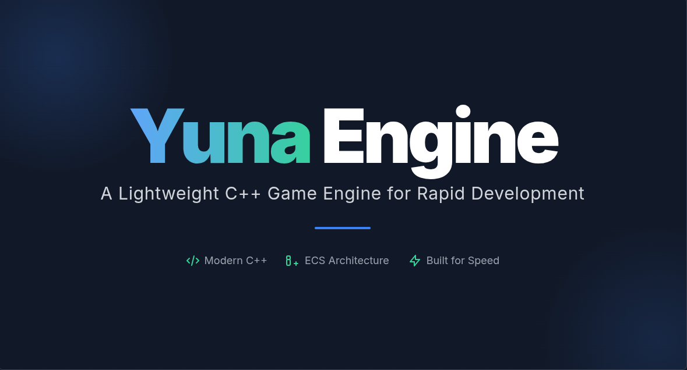

# Yuna Engine

**Yuna** is a modern, lightweight C++ game engine built on top of SFML, designed for rapid prototyping and development of 2D games. Named with elegance and simplicity in mind, Yuna provides a comprehensive suite of tools and systems for game development while maintaining clean, modular architecture.

## 🚀 Features

### Core Systems
- **Application Framework**: Complete application lifecycle management with state-based architecture
- **Window Management**: Cross-platform window creation and management via SFML
- **State Manager**: Robust state machine system for game flow control (menus, gameplay, transitions)
- **Resource Manager**: Efficient asset loading and management for textures, sounds, and other resources
- **Event Handling**: Comprehensive input and event processing system
- **Console System**: Built-in developer console with command registration and debugging capabilities

### Game Development Modules
- **🧠 AI System**: Artificial intelligence framework with pathfinding capabilities
- **🌍 World Management**: Entity-component system for game world organization
- **🔢 Math Library**: Mathematical utilities including trigonometry functions
- **⚡ Physics Engine**: Collision detection and physics simulation
- **🛠️ Utilities**: Helper tools including QuadTree spatial partitioning
- **🎨 GUI Integration**: Built-in mfGUI library for user interface development

### Additional Features
- **Sandbox Environment**: Complete testing and development sandbox
- **Cross-Platform**: Built with CMake for easy compilation across different platforms
- **Modern C++17**: Leverages modern C++ features and best practices
- **Modular Architecture**: Clean separation of concerns with namespace organization

## 📁 Project Structure

```
Yuna/
├── includes/           # Header files
│   ├── core/          # Core engine systems
│   │   ├── console/   # Developer console
│   │   ├── eventHandler/ # Input and event processing
│   │   ├── resourceManager/ # Asset management
│   │   └── stateManager/ # State machine system
│   ├── ai/            # Artificial intelligence
│   │   └── pathFinding/ # Pathfinding algorithms
│   ├── math/          # Mathematical utilities
│   │   └── trigonometry/ # Trigonometric functions
│   ├── physics/       # Physics simulation
│   │   └── collisions/ # Collision detection
│   ├── utils/         # Utility functions
│   │   └── qTree/     # QuadTree implementation
│   └── world/         # World management
│       └── objects/   # Game objects
├── src/               # Source implementations
├── mfGUI/             # Integrated GUI library
├── sandbox/           # Development sandbox
└── lib/               # Compiled libraries
```

## 🛠️ Build Requirements

### Dependencies
- **CMake** 3.10 or higher
- **C++17** compatible compiler
- **SFML 2.x** (graphics, window, system, network, audio)
- **Ninja** (recommended build system)

### Platform-Specific Installation

#### Fedora/RHEL
```bash
sudo dnf install cmake ninja-build
sudo dnf install SFML-devel boost-devel
```

#### Ubuntu/Debian
```bash
sudo apt install cmake ninja-build
sudo apt install libsfml-dev libboost-all-dev
```

## 🔧 Building

### Quick Start
```bash
# Generate build files
cmake -G Ninja .

# Build the engine
ninja

# Build and run tests
ninja run_tests

# Build and run sandbox
ninja run_sandbox
```

### Build Targets
- `Yuna` - Main engine library (static)
- `MFGUI` - GUI library
- `sandbox` - Development sandbox executable
- `run_tests` - Run engine tests
- `run_sandbox` - Run sandbox application

### Build Configurations
```bash
# Debug build (default)
cmake -DCMAKE_BUILD_TYPE=Debug -G Ninja .

# Release build
cmake -DCMAKE_BUILD_TYPE=Release -G Ninja .
```

## 🎮 Getting Started

### Basic Application
```cpp
#include "Yuna.hpp"

class MyGame : public Yuna::Application {
public:
    MyGame() {
        // Initialize your game
    }
    
    ~MyGame() {
        // Cleanup
    }
};

int main() {
    MyGame game;
    game.Run();
    return 0;
}
```

### Creating a Game State
```cpp
#include "core/stateManager/State.hpp"

class GameState : public Yuna::Core::State {
public:
    void Update(float deltaTime) override {
        // Update game logic
    }
    
    void Render() override {
        // Render game objects
    }
    
    void HandleEvents() override {
        // Handle input events
    }
};
```

## 📚 Core Components

### State Management
The engine uses a state-based architecture where different game screens (menu, gameplay, pause) are managed as separate states:

- `NEXT_STATE` - Transition to next state
- `PREVIOUS_STATE` - Return to previous state  
- `REPLACE_STATE` - Replace current state
- `BACK_TO_ENTRY` - Return to entry state
- `EXIT` - Exit application

### Resource Management
Efficient loading and caching of game assets:
- Texture loading and management
- Sound and music handling
- Automatic resource cleanup
- Memory-efficient asset storage

### Console System
Built-in developer console for debugging and runtime commands:
- Command registration system
- Runtime variable modification
- Debug output and logging
- Extensible command framework

## 🧪 Development

### Sandbox
The included sandbox provides a testing environment for engine features:
```bash
cd sandbox
ninja run_sandbox
```

### Integration
Yuna can be easily integrated into existing projects as a static library. Simply link against `libYuna.a` and include the headers.

## 📄 License

This project is licensed under the **GNU General Public License v3.0**. See the [LICENSE](LICENSE) file for details.

## 🤝 Contributing

Contributions are welcome! Please feel free to submit issues, feature requests, or pull requests to help improve Yuna Engine.

## 📞 Support

For questions, issues, or feature requests, please open an issue on the project repository.

---

**Yuna Engine** - *Elegant simplicity for game development*